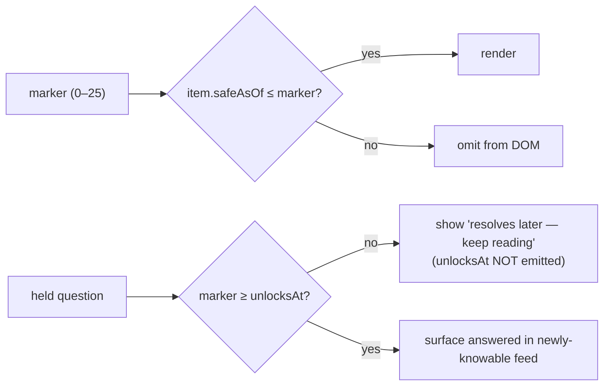

# Gardens Grimoire - Plan

> **Product Contract preservation:** Product Contract unchanged. `ce-plan` enriched this file in place, appending the Planning Contract (Key Technical Decisions, High-Level Technical Design, Output Structure, Implementation Units U1–U8, Verification Contract, Definition of Done, Risks, Sources). The WHAT above the `---` before "Planning Contract" is the brainstorm's; the HOW below it is planning's.
>
> **Coverage (confirmed 2026-07-25):** full v1 in one plan (all three surfaces + workflow + data controls + schema contract), 8 dependency-ordered units. Old-entry migration deferred (start content clean). Tests: logic-focused Node unit tests + browser visual pass via Claude-in-Chrome. Workflow artifacts (`WORKFLOW.md`/`RULES.md`) in scope.

## Goal Capsule

- **Objective:** A fresh, GitHub-hosted static reading companion for Steven Erikson's *Gardens of the Moon* (Book One of *The Malazan Book of the Fallen*). It lets the reader capture position-scoped notes as they read, then have a rule-bound Claude workflow refine those notes into spoiler-safe, authority-cited knowledge — so the reader never misses atmosphere and stays comfortable not-yet-knowing.
- **Product authority:** Ed (the reader / sole user). Personal project.
- **Open blockers:** (1) ~~Confirm the wiki's section enumeration.~~ **RESOLVED 2026-07-25** — read the authority directly (Chrome extension granted `malazan.fandom.com`); the canonical position spine and per-chapter source URLs are now pinned in "Canonical Position Spine & Authority Source Map" below. (2) Round-trip persistence mechanism (localStorage staging ↔ repo data files) needs a concrete design in planning — the *rule* is settled here, the *implementation* is not.

## Product Contract

### Problem & Vision

*Gardens of the Moon* drops the reader mid-story with zero handholding. A first-time reader constantly meets names, places, and powers with no context and no safe way to look things up — every wiki or guide is a full-series spoiler minefield. The reader wants to feel **comfortable not knowing**, trust the book's pacing, and still absorb the atmosphere and weight of what they're reading.

The vision: a companion that captures what the reader notices, then — through a strictly rule-bound Claude workflow sourcing from a single chapter-aligned authority — tells them exactly what is **knowable given their present reading position**, and nothing beyond it. A journal that graduates into a grimoire.

### Primary Actor & Core Outcome

- **Actor:** the reader, reading *Gardens of the Moon* for the first time.
- **Outcome:** at any moment, a spoiler-safe, authority-cited view of everything they're cleared to understand up to their current chapter — plus a patient holding pattern for everything they're not yet cleared to know.

### The Core Loop

1. **Read & capture** — In the Journal, the reader advances a "next section" control to the book section they're in and jots raw notes: names, people, places, things, and questions. Entries save with real timestamps.
2. **Process** — On demand, the reader runs the Claude workflow. It reads the exported journal up to the current position, sources spoiler-safe detail from the authority, and writes back refined content.
3. **Browse safely** — The reader reads the "Previously On…" recap on the landing page, sees refined journal entries, and explores accumulating entity dossiers in the Grimoire — all gated to their position.

### Surfaces

The app has **three surfaces** over one position-aware dataset.

**1. Landing — "Previously On…"**
- A TV-recap-style narrative of the story **so far, up to the current position** ("Previously, in *Gardens of the Moon*…").
- A "**things you should have noticed**" section: callouts of weighty but easily-glossed details from the section(s) already read. **Past-facing only** — it highlights significance already on the page; it never hints at, teases, or foreshadows what is coming.
- Generated by the workflow; strictly position-bounded.

**2. Journal**
- A "**next section**" control walks the reader forward through the book (Prologue → Book/chapter units per the authority's own structure).
- The reader captures raw notes for the current section. Entries carry **real timestamps** and list newest-first (chronological capture order, distinct from book-position order).
- Each entry has a lifecycle: **`raw` → `refined`**. After processing, the entry **displays the refined, authority-sourced, spoiler-safe version**, which **replaces** the raw text in the main view. The **original raw note is preserved as provenance** — one click to expand "your original words." This keeps the observed-vs-sourced distinction that the no-inference discipline depends on.

**3. Grimoire**
- **Accumulating per-entity dossiers**: each entity (person/place/culture/religion/politics/war/lore/thing) stacks its safe insights as dated layers ("as of Ch.3 … as of Ch.7 …") as the reader advances.
- **"Newly knowable" feed**: advancing the position marker surfaces exactly what just unlocked — new insight layers and newly-answerable held questions.
- **Held questions**: a logged question that can't be answered without spoiling parks with an *internally stored* unlock chapter, shown only as "resolves later — keep reading." When the reader reaches that chapter, it auto-surfaces answered in the newly-knowable feed. **The unlock chapter is never displayed until it fires** (no distance-to-payoff leak).

### Position Model

- The site always tracks the **current book + chapter being developed** — a single position marker.
- That one marker drives: the Journal capture default section, the Grimoire visibility gate, the recap boundary, and the scope of what the workflow processes.
- **Granularity is per-chapter**, grouped under the book's seven named Books. The full spine is pinned below.

### Canonical Position Spine & Authority Source Map (confirmed 2026-07-25)

Read directly from the authority. This is the fixed enumeration the position model, the data files, and the workflow all reference — no drift.

**The position spine — 26 ordered positions:**

| Ord | Position | Book (grouping) |
|----|----------|-----------------|
| 0  | Prologue | — |
| 1  | Chapter 1 | Book One: Pale |
| 2  | Chapter 2 | Book One: Pale |
| 3  | Chapter 3 | Book One: Pale |
| 4  | Chapter 4 | Book One: Pale |
| 5  | Chapter 5 | Book Two: Darujhistan |
| 6  | Chapter 6 | Book Two: Darujhistan |
| 7  | Chapter 7 | Book Two: Darujhistan |
| 8  | Chapter 8 | Book Three: The Mission |
| 9  | Chapter 9 | Book Three: The Mission |
| 10 | Chapter 10 | Book Three: The Mission |
| 11 | Chapter 11 | Book Four: Assassins |
| 12 | Chapter 12 | Book Four: Assassins |
| 13 | Chapter 13 | Book Four: Assassins |
| 14 | Chapter 14 | Book Five: The Gadrobi Hills |
| 15 | Chapter 15 | Book Five: The Gadrobi Hills |
| 16 | Chapter 16 | Book Five: The Gadrobi Hills |
| 17 | Chapter 17 | Book Six: The City of Blue Fire |
| 18 | Chapter 18 | Book Six: The City of Blue Fire |
| 19 | Chapter 19 | Book Six: The City of Blue Fire |
| 20 | Chapter 20 | Book Seven: The Fête |
| 21 | Chapter 21 | Book Seven: The Fête |
| 22 | Chapter 22 | Book Seven: The Fête |
| 23 | Chapter 23 | Book Seven: The Fête |
| 24 | Chapter 24 | Book Seven: The Fête |
| 25 | Epilogue | — |

(24 chapters across 7 Books + Prologue + Epilogue. The seven Book names are display groupings; the **chapter** is the atomic position.)

**Authority source URLs:**
- **Per-chapter summary pages (the workflow's primary source):** `https://malazan.fandom.com/wiki/Gardens_of_the_Moon/Chapter_<N>` for N = 1–24. **Confirmed:** these subpages are genuinely chapter-scoped — the Chapter 1 page covers only Chapter 1 events and does not reveal later content. Prologue and Epilogue use the same subpage pattern (`/Gardens_of_the_Moon/Prologue`, `/Gardens_of_the_Moon/Epilogue`) — exact slug to be confirmed on first run.
- **Main page** `https://malazan.fandom.com/wiki/Gardens_of_the_Moon` — useful for the Book-name groupings and the pagination index, **but its "Plot summary" section spans all seven Books and is a full-book spoiler surface.**

**Spoiler hazard discovered while reading (now a hard rule):** the workflow must source from the **per-chapter subpages at or below the current position** — it must **never** read the main page's full "Plot summary" (which spans the whole book), and must **never** follow the outbound entity links on any chapter page (character/place pages carry full-series spoilers). See workflow rule 4.

### The Spoiler Firewall (settled mechanics)

- Every insight is **position-stamped** ("safe as of Chapter K").
- The Grimoire shows only insights where `K ≤ current marker`.
- Because the authority is **itself chapter-segmented**, "what the authority's Chapter K page says" is inherently safe-as-of-Chapter-K — the source's structure does the position-stamping.
- This is a **reading-experience guarantee, not a security boundary.** No cryptographic hiding; a curious reader can always view-source. The firewall exists to protect the reader from *accidentally* spoiling themselves, not to make spoilers technically unreachable.

### Data Model & Content Storage

- Content lives as **structured JSON data files** (e.g., per-section files + an entities file). The **data is the product**: it is simultaneously the spoiler engine's input, the render source, and the future **graph-DB export** (entities = nodes, type = class, cross-references = candidate edges — the original grimoire vision, preserved).
- The app is a **dumb, spoiler-safe renderer over a smart dataset.** All intelligence lives in the processing workflow, not the app code. The code filters `position ≤ marker` and paints three surfaces; it barely changes while the reading content grows constantly.

### Data Compatibility Contract (backward + forward compatible, forever)

The dataset must remain **readable and writable across every version of the solution as it evolves** — old exports always open in new code (backward), and newer exports degrade gracefully in older code (forward). This is a hard, permanent contract, not a nice-to-have, because the data outlives every build and is the eventual graph-DB export.

**The contract:**

1. **Versioned schema.** Every data file (and every export) carries an explicit `schemaVersion`. Nothing is ever interpreted without knowing its version.
2. **Additive-only evolution.** New fields are always **optional with a defined default**. Existing fields are **never renamed, retyped, or repurposed** in place — a field's meaning is fixed for life. A changed meaning is a new field.
3. **Deprecate, never delete.** Retired fields are kept and ignored, not removed. Nothing that ever held data is dropped from the shape.
4. **Preserve unknown fields (the forward-compat keystone).** The renderer **ignores** fields it doesn't understand but **round-trips them on export** — so `newer export → older app → re-export` never silently loses data.
5. **One-directional upgrade ladder.** A pure, versioned `upgrade(data)` chain lifts any older version to current on load/import. Migrations are lossless and never assume a downgrade path.
6. **Stable, never-reused IDs.** Entity and entry IDs are stable and permanent, so cross-references (the graph edges) survive every schema change.
7. **Position model is data, not code.** The section/chapter enumeration lives in the data, so extending the book's structure never requires a code change or breaks old files.
8. **Import validates then migrates.** Import tolerates missing optional fields, runs the upgrade ladder, and never hard-fails on an older or partially-newer file.
9. **Self-describing exports.** Every export includes its `schemaVersion` and minimal provenance so any future tool — including the graph-DB importer — can interpret it standalone.

A change that cannot be expressed within rules 2–4 is a **breaking change** and requires a `schemaVersion` major bump **plus** an upgrade-ladder step that reads the old shape — never a silent in-place redefinition.

### Round-Trip Reconciliation Rule

The raw journal is captured in the browser (localStorage); the workflow runs in Claude Code and writes refined content to the repo's data files. The rule that keeps this coherent:

> **The repo data files are the source of truth for anything processed. localStorage holds only raw notes not yet exported.** Export bundles the pending raw notes for the workflow. Once refined content lands in the repo and is served back, the matching localStorage staging entries clear. This is how "one evolving log" stays consistent across the browser/repo boundary without double-counting.

### Data Controls

- **Reset** — wipe journal/state to start fresh.
- **Export** — all logged entries → portable JSON (also the artifact the workflow consumes, and a backup).
- **Import** — load a previously exported log (restore, or move between machines).

### The Processing Workflow & Its Rules (zero-exception governance)

The workflow is a **saved, versioned artifact in the repo** (e.g., `WORKFLOW.md` + a canonical `RULES.md`), run **on demand** in Claude Code — not a hosted cron. It matches how garage projects already run through the CE pipeline.

**Its first action every run is to read the canonical rules and obey them strictly, with zero exceptions.** The rules, as articulated by the reader:

1. **Read the rules first, every run.** The workflow must load `RULES.md` at the start of every processing run and follow it strictly — no exceptions, no improvisation, no "close enough."
2. **No inference.** The workflow must never infer, guess, extrapolate, or fill gaps from its own background knowledge of Malazan. If a fact is not present in the authority at or below the current position, it is not written.
3. **Everything is cited to the source authority.** Every refined detail must be attributable to the **specific per-chapter subpage it was read from** (`.../Gardens_of_the_Moon/Chapter_<N>`, or the Prologue/Epilogue subpage) — the exact page + section, never the bare main-page URL (which rule 4 forbids reading). The citation points at what was actually sourced.
4. **Authority discipline — per-chapter subpages only, never the master summary, never the links.** The workflow sources **only from the per-chapter summary subpages** (`.../Gardens_of_the_Moon/Chapter_<N>`, plus Prologue/Epilogue subpages) at or below the current position. It **must never** read the main GotM page's "Plot summary" section (it spans all seven Books = full-book spoiler), and **must never follow the outbound entity links** on any chapter page (character/place pages carry full-series spoilers). This rule is what keeps the "absolute authority" from becoming an absolute spoiler. (See "Canonical Position Spine & Authority Source Map" for the exact URLs.)
5. **Position boundary is absolute.** Nothing above the current marker is read, sourced, refined, surfaced, or hinted at — including in the recap's "things you should have noticed" callouts and in held-question estimates.
6. **Held-question estimates stay hidden.** The unlock chapter for a held question is stored to fire the trigger and is never rendered until it fires.

Outputs of a run: refined journal entries (raw preserved as provenance), position-stamped entity dossier layers, resolved held questions, and the "Previously On…" recap + "things you should have noticed" for the current position. Commit → GitHub Pages redeploys.

### Visual Design

- **Aesthetic:** clean, highly legible **dark text on a parchment ground** — a calm reading surface, not the old dark-arcane theme. Prioritize readability (generous line length limits, comfortable type scale, strong contrast).
- **Raw vs refined must be visually distinct.** The two states read differently at a glance — e.g., raw notes styled as informal margin scrawl / handwritten-feeling, unfinished; refined entries styled as set, "illuminated" type with a clear "refined ✓ · cited" treatment. The transition raw → refined should feel like a note being formally inscribed. (Exact styling is a design task for planning/build; the *requirement* is an unmistakable visual state change.)

### Architecture & CI/CD

- **No-build client-side render** (Approach A): a static `index.html` + light JS fetches the JSON data files and renders the three surfaces in the browser. Push → GitHub Pages serves it. Simplest possible CI/CD — the deploy just copies files; there is no build toolchain to maintain "as it evolves."
- Later hardening option (deferred, no schema change): pre-split data by position at build so the browser never downloads insights past the marker (Approach C).

### Non-Goals

- No server, database, or accounts — static files only.
- The **app never generates insights itself** — only the rule-bound workflow does, in-session.
- Authority is the **Malazan Fandom wiki only**, scoped to **book one of the series (*Gardens of the Moon*)** only — not a general Malazan wiki, not multi-book. ("Book one" here means the novel, distinct from the inner "Book One: Pale" division in the position spine.)
- **No hard/cryptographic spoiler-hiding** — reading-experience guarantee, not security.
- No scene/page sub-chapter granularity — position granularity follows the authority's section breakdown.

### Key Decisions

- **Spoiler firewall = position-stamped insights gated by a "currently reading" marker.** *(session-settled)*
- **Grimoire = accumulating per-entity dossiers + "newly knowable" unlock feed.** *(session-settled)*
- **Held questions auto-surface when answerable; unlock chapter hidden until it fires.** *(session-settled)*
- **Content stored as structured JSON data files (= graph-DB export).** *(session-settled)*
- **No-build client render + GitHub Pages auto-deploy (Approach A).** *(session-settled)*
- **Raw journal entries refine in place; refined replaces the display, raw kept as provenance.** *(session-settled)*
- **Authority = Malazan Fandom wiki GotM page; source chapter-summary prose only, never the entity links.** *(session-settled)*
- **Processing is a rule-bound, zero-exception workflow that reads `RULES.md` first, never infers, cites everything to the authority.** *(session-settled)*
- **Parchment aesthetic with an unmistakable raw→refined visual state change.** *(session-settled)*
- **Data is backward- and forward-compatible forever via a versioned, additive-only, unknown-field-preserving schema contract.** *(session-settled)*
- **Fresh project; old single-file build archived to `archive/gardens-grimoire-singlefile/`; name `gardens-grimoire` reused.** *(session-settled)*

### Assumptions (to validate in planning/build)

- ~~The wiki's section list is unconfirmed.~~ **Resolved** — see "Canonical Position Spine & Authority Source Map" (26 positions, confirmed URLs). Only remaining sliver: the exact Prologue/Epilogue subpage slugs (same pattern, confirm on first run).
- Entity types carry over from the prior build (person, place, culture, religion, politics, war, lore) **plus a new `thing`/artifact type.**
- The 25 entries from the archived single-file build may be migrated into the new schema (optional; not required for v1).
- The reader runs the workflow manually from Claude Code against the exported journal.

### Outstanding Questions

- **Persistence round-trip:** concrete mechanism for localStorage staging ↔ repo data-file reconciliation (the *rule* is settled; the *implementation* — e.g., export/import files vs. a GitHub-token write path — is a planning decision).
- ~~Authority section map~~ **Resolved** — pinned in "Canonical Position Spine & Authority Source Map."
- **Migration:** whether to port the archived 25 entries or start content clean.
- **Prologue/Epilogue subpage slugs:** confirm the exact URLs on the first workflow run (minor).

### Success Criteria / Acceptance Signals

- The reader can advance a section marker, capture timestamped raw notes for that section, and see them logged — with no server.
- Running the workflow refines those notes into cited, position-safe content that visibly replaces the raw text while preserving the original as provenance.
- The Grimoire shows only content at or below the marker; advancing the marker reveals a "newly knowable" feed; no content above the marker is ever visible.
- Held questions never display their unlock chapter until they fire.
- The landing page shows a spoiler-safe "Previously On…" recap bounded to the current position.
- A push deploys via GitHub Pages with no build step.
- Every refined detail traces to a specific authority section; a spot-check finds zero uncited or inferred facts.
- An export from an older schema version opens cleanly in a newer build (backward), and a newer export loaded by an older build preserves its unknown fields on re-export (forward) — verified by a round-trip test.

---

# Planning Contract (HOW)

## Consolidated Research & Patterns

This is a fresh project (no code yet) inside `~/ClaudeGarage/personal/gardens-grimoire/`. There is no local codebase to mirror, but two sibling garage projects establish directly reusable patterns:

- **`ddo-loadout-optimizer`** — a split, no-*app*-build static site deployed to GitHub Pages. Its `web/` layout (thin `index.html` + `styles.css` + plain `<script>` modules + `web/data/*.json` fetched **page-relative**), its GitHub Actions `deploy.yml`, and its **isomorphic modules** (browser globals + Node `module.exports`, unit-tested with plain `node tests/*.test.js` and built-in `assert`, no jsdom) are the template. We adopt this **minus its Python `build_dataset.py` step** — our data files are authored by the workflow and committed, not generated in CI.
- **`sooks-saga-scroll`** — single-file variant; source of the `Build mmddyyyy.N` footer stamp, aggressive no-cache `<head>` meta, the separate-localStorage-keys discipline (state vs cache/meta kept in different keys so the state schema stays stable), and the `node --check` + Claude-in-Chrome visual-gate verification method.

Reusable learnings (from sibling `docs/solutions/`):
- **Pages site root = the uploaded dir.** Uploading `web/` makes `web/` the root — live paths drop the `web/` prefix (`web/app.js` → `<pages-url>/app.js`). Fetch data page-relative (`fetch("data/…")`) so it works identically under `python3 -m http.server` and on Pages.
- **Enable Pages explicitly once:** `gh api -X POST /repos/<owner>/<repo>/pages -f build_type=workflow` before the first push, or the first deploy fails.
- **Transient deploy timeout at `updating_pages`** → `gh run rerun <id> --failed`, don't debug code.
- **`grep -m1`, never `grep | head`** inside any `set -euo pipefail` script (SIGPIPE → exit 141 → job fails). Our deploy avoids grep entirely, so this is moot here but noted.
- **Fandom `WebFetch` returns 402** — the workflow must read the wiki via Claude-in-Chrome `navigate` + `get_page_text` (permission granted for `malazan.fandom.com`). Same anti-bot pattern as the DDO wiki.

External research: **not run** — deployment is well-established locally, the wiki structure is already confirmed, and the schema-compat pattern is standard. No unsettled external option set shapes a decision here.

---

## Key Technical Decisions

**KTD1 — No-build static site; `web/` is the Pages site root; JSON fetched page-relative.** *(session-settled: user-directed — chosen over an SSG build (Approach B) and a single-file HTML app: simplest CI/CD "as it evolves". Note: "Approach C" refers to the deferred per-position pre-split hardening in KTD5, not single-file HTML.)* Mirrors `ddo-loadout-optimizer` minus the Python build. App assets and data live under `web/`; everything else (workflow docs, plans) stays at repo root and is not served.

**KTD2 — Logic lives in isomorphic modules (browser global + Node `module.exports`).** Every logic-bearing module (`schema.js`, `position.js`, `journal.js`, `datacontrols.js`, `grimoire.js`, `recap.js`) runs in the browser as a global and exports for Node so it is unit-testable with `node tests/*.test.js` and built-in `assert` — no jsdom, no runner, no dependencies. This is the enabling decision behind the whole test strategy and mirrors the sibling pattern exactly.

**KTD3 — GitHub Actions Pages deploy, no build step.** Workflow = `checkout@v5` → `configure-pages@v6` → `upload-pages-artifact@v5 (path: web)` → `deploy-pages@v5`, with the standard `permissions` (`contents: read`, `pages: write`, `id-token: write`) and `concurrency: {group: pages, cancel-in-progress: false}` blocks. Trigger: push to `main` + `workflow_dispatch`. Committed JSON data (not gitignored — no CI regeneration).

**KTD4 — Versioned schema; additive-only; unknown-field preserving; one-directional upgrade ladder.** *(session-settled: user-directed — the Data Compatibility Contract, chosen for permanent backward+forward compatibility and the graph-DB export future.)* A `SCHEMA_VERSION` constant, a pure `migrate(data)` ladder that lifts any older version to current on load/import, a tolerant `validate()` that defaults missing optionals, and a merge that **round-trips unknown keys** (forward-compat keystone). Breaking changes bump the major version and add a ladder step — never an in-place redefinition.

**KTD5 — Four committed data files, each `schemaVersion`-stamped.** `web/data/positions.json` (the fixed 26-position spine — static reference), `web/data/entities.json` (entity nodes + their position-stamped insight layers = graph nodes), `web/data/journal.json` (refined journal entries with preserved raw provenance + held questions), `web/data/recaps.json` (per-position recap prose + "things you should have noticed"). Few files keep page-relative fetch simple; the split is graph-export-ready. (Per-position file splitting to harden the firewall against view-source is the deferred Approach C — no schema change needed later.)

**KTD6 — Two separate localStorage keys.** `ggState` (current marker, last-seen marker for the unlock feed, settings) and `ggJournalStaging` (raw, not-yet-exported notes). Repo data files are the source of truth for anything refined; staging holds only un-exported raw. Mirrors sooks' separate-keys discipline so the persisted shape stays stable.

**KTD7 — Firewall enforced at the render boundary by a single gate.** Every insight layer, recap block, and refined entry carries `safeAsOf` (a position ordinal 0–25); the render gate shows an item only when `safeAsOf ≤ marker`. Held questions carry an internal `unlocksAt` that is **never emitted to the DOM** until `marker ≥ unlocksAt`. One gate function, reused by all three surfaces.

**KTD8 — Parchment design via CSS tokens; raw vs refined are distinct visual states.** A small token set (parchment ground, ink, accent) in `styles.css`; `.entry--raw` reads as informal/handwritten and unfinished, `.entry--refined` as set "inscribed" type with a `cited ✓` chip and a provenance disclosure. The raw→refined transition is an unmistakable visual change (a hard requirement). **Responsive:** the layout targets one-handed mobile/tablet use beside a physical book — a single-column reading measure, comfortable touch targets, and tab navigation that works at phone width.

**KTD9 — The processing workflow is repo prose artifacts, run on demand in Claude Code.** `RULES.md` (the six zero-exception rules) + `WORKFLOW.md` (the procedure) at repo root. Not app code, not CI. Reads `RULES.md` first every run; sources per-chapter subpages ≤ marker via Claude-in-Chrome; writes schema-conformant data; commit → Pages redeploys.

---

## High-Level Technical Design

The round-trip loop (browser capture ↔ repo data ↔ rule-bound workflow ↔ authority):

```mermaid
flowchart TD
  subgraph Browser["Browser app (web/, no build)"]
    L["Landing — Previously On…"]
    J["Journal (raw→refined)"]
    G["Grimoire (dossiers + feed + held Qs)"]
    LS[("localStorage<br/>ggState + ggJournalStaging")]
    J -->|raw notes, timestamped| LS
  end
  subgraph Repo["Repo (GitHub, committed)"]
    D[("web/data/*.json<br/>schemaVersion'd")]
    RULES["RULES.md + WORKFLOW.md"]
  end
  subgraph WF["Claude workflow (on demand, Claude Code)"]
    P["Process ≤ marker"]
  end
  Wiki[["Malazan wiki<br/>per-chapter subpages<br/>(Claude-in-Chrome)"]]

  LS -->|Export bundle| P
  RULES -->|read first, zero exceptions| P
  Wiki -->|chapter-summary prose only,<br/>never main summary,<br/>never entity links| P
  P -->|refined entries, insight layers,<br/>recaps, held-Q unlocksAt| D
  D -->|page-relative fetch, gated safeAsOf ≤ marker| L
  D --> G
  D -->|refined replaces staged raw<br/>(reconcile by id)| J
  D -->|push → Pages Action| Deploy(["GitHub Pages"])
```

Render gating (the one firewall gate, reused by every surface):



---

## Output Structure

```text
gardens-grimoire/
  .github/workflows/deploy.yml     # Pages deploy (no build)
  .gitignore
  README.md                        # exists; update with build/run + resume prompt
  RULES.md                         # U8 — zero-exception processing rules
  WORKFLOW.md                      # U8 — the processing procedure + authority source map
  web/                             # Pages site root
    index.html                     # three-tab shell, no-cache meta, build stamp
    styles.css                     # parchment tokens; raw vs refined states
    app.js                         # tab chrome, App event bus, marker + capture UI
    schema.js                      # SCHEMA_VERSION, migrate(), validate(), merge-preserve
    position.js                    # ordering, next/prev, gate(items, marker)
    journal.js                     # staging, raw→refined merge, provenance
    datacontrols.js                # export / import / reset / reconcile
    grimoire.js                    # dossiers, newly-knowable diff, held-Q surfacing
    recap.js                       # per-position recap selection
    data/
      positions.json              # the fixed 26-position spine (seed)
      entities.json               # entity nodes + insight layers (seed: empty)
      journal.json                # refined entries + provenance + held Qs (seed: empty)
      recaps.json                 # per-position recap + noticed callouts (seed: empty)
  tests/
    schema.test.js  position.test.js  journal.test.js
    datacontrols.test.js  grimoire.test.js  recap.test.js
  docs/plans/…                     # this plan
```

The per-unit `**Files:**` lists are authoritative; this tree is the scope-shape declaration.

---

## Implementation Units

### U1. Repo scaffold, Pages deploy, parchment app shell

- **Goal:** A deployable empty three-tab app on parchment, live on GitHub Pages, with no build step.
- **Requirements:** Architecture & CI/CD; Visual Design (parchment); Surfaces (shell only).
- **Dependencies:** none.
- **Files:** `.github/workflows/deploy.yml`, `web/index.html`, `web/styles.css`, `web/app.js`, `.gitignore`, `README.md` (update), `git init` for the project.
- **Approach:** Three-tab chrome (Landing / Journal / Grimoire). Parchment design tokens + the `.entry--raw` / `.entry--refined` state styles (used later). `App` event bus (`App.ready(cb)`) so views await data without script-order assumptions, with a **loading state** until data resolves and a **fetch-failure state** (mirror ddo's graceful `app.js` error) — neither should look like the true empty state. Page-relative fetch scaffolding. `Build mmddyyyy.N` footer stamp + no-cache `<head>` meta. Keyboard-navigable tabs. Deploy = ddo's workflow minus `setup-python`/build/tests.
- **Patterns to follow:** `ddo-loadout-optimizer/web/` layout + `.github/workflows/deploy.yml`; `sooks-saga-scroll` footer stamp + no-cache meta.
- **Execution note:** Mostly scaffold/styling — verify by serving `web/` and viewing in Claude-in-Chrome, not unit tests. One-time before first push: `gh api -X POST /repos/<owner>/gardens-grimoire/pages -f build_type=workflow`.
- **Test scenarios:** `Test expectation: none — scaffold + styling; verified by the browser visual pass in the Verification Contract.`
- **Verification:** `web/` serves locally; three tabs switch; parchment renders; push to `main` deploys and the Pages URL returns 200.

### U2. Versioned data schema + compatibility layer + seed data files

- **Goal:** The schema backbone and its permanent backward/forward-compat guarantees, plus seed data files.
- **Requirements:** Data Model & Content Storage; **Data Compatibility Contract** (all 9 rules); Canonical Position Spine.
- **Dependencies:** U1.
- **Files:** `web/schema.js`, `web/data/positions.json`, `web/data/entities.json`, `web/data/journal.json`, `web/data/recaps.json`, `tests/schema.test.js`.
- **Approach:** `SCHEMA_VERSION` constant; per-file `schemaVersion`. `migrate(data)` upgrade ladder (pure, lossless, one-directional). `validate()` tolerant of missing optionals. A merge that preserves unknown keys and round-trips them on export. `positions.json` seeds the confirmed 26-position spine (Prologue 0 … Epilogue 25) with Book groupings; other files seed empty-but-valid.
- **Patterns to follow:** isomorphic module shape (`module.exports` guard) like ddo modules; sooks' versioned-read migration.
- **Execution note:** Test-first — write the round-trip and migration tests before the `migrate` ladder.
- **Test scenarios:**
  - An older `schemaVersion` payload upgrades to current via the ladder, lossless (values preserved).
  - A payload carrying an **unknown future field** survives `load → export` unchanged (forward-compat keystone).
  - A payload missing an optional field loads with the defined default, no throw.
  - A partial/malformed payload does not hard-fail import — it migrates/validates gracefully or reports, never crashes.
  - A simulated major-version bump routes through a ladder step rather than reading the old shape in place.
  - `positions.json` has exactly 26 ordered positions; ordinal 0 = Prologue, 25 = Epilogue; Book groupings match (Pale 1–4, Darujhistan 5–7, The Mission 8–10, Assassins 11–13, The Gadrobi Hills 14–16, The City of Blue Fire 17–19, The Fête 20–24).

### U3. Position engine + "currently reading" marker + section navigation

- **Goal:** The single position marker and gate that drive all three surfaces.
- **Requirements:** Position Model; Spoiler Firewall (mechanics).
- **Dependencies:** U2.
- **Files:** `web/position.js`, `web/app.js` (marker UI + next-section control), `tests/position.test.js`.
- **Approach:** Marker persists in `ggState`. `next()`/`prev()` walk `positions.json`. The UI exposes **both a "next section" and a back control** (`prev()`), so a reader who over-advances can retreat — the marker is not one-way, which supports the "comfortable not knowing" outcome. `gate(items, marker)` returns only items with `safeAsOf ≤ marker`. Book-grouping label resolves from a chapter ordinal.
- **Patterns to follow:** isomorphic module; `ggState` localStorage key (KTD6).
- **Test scenarios:**
  - `gate` shows items with `safeAsOf ≤ marker`, hides `> marker`.
  - `next` advances Prologue → Ch.1 → … → Epilogue and clamps at both ends.
  - Marker persists across reload.
  - Book label resolves correctly for a chapter ordinal (e.g., Ch.6 → "Book Two: Darujhistan").

### U4. Journal capture + raw→refined display + localStorage staging

- **Goal:** Capture timestamped raw notes per section; display refined entries that replace raw while preserving provenance.
- **Requirements:** Surfaces §2 (Journal); raw→refined lifecycle; Visual Design (raw vs refined).
- **Dependencies:** U3.
- **Files:** `web/journal.js`, `web/app.js` (journal tab + capture form), `web/styles.css` (state styles), `tests/journal.test.js`.
- **Approach:** Capturing a raw note for the current section writes to `ggJournalStaging` with a timestamp + position + stable id, rendered newest-first. Refined entries come from `journal.json` and replace the raw display, with a provenance disclosure showing the original words. Visual distinction per KTD8. **First-run empty state:** with zero staged notes and empty `journal.json`, the Journal shows an invitation to set the section marker and jot the first note — never a blank panel that reads as broken. The provenance disclosure is collapsed by default and keyboard-operable.
- **Patterns to follow:** isomorphic module; separate `ggJournalStaging` key.
- **Execution note:** none (standard behavior).
- **Test scenarios:**
  - Adding a raw note stamps timestamp + current position + stable id and persists to staging.
  - A refined entry from `journal.json` renders refined text with a provenance field equal to the preserved original raw note.
  - Entries render newest-first by timestamp.
  - `Covers` the "refined replaces display, raw kept as provenance" contract: rendering a refined entry never loses its raw original.
  - With zero staged notes and empty `journal.json`, the Journal renders its first-run invitation state, not a blank panel.

### U5. Reset / Import / Export + round-trip reconciliation

- **Goal:** Data portability and the browser↔repo reconciliation that keeps "one evolving log" coherent.
- **Requirements:** Data Controls; Round-Trip Reconciliation Rule; Data Compatibility Contract (import path).
- **Dependencies:** U4 (staging), U2 (schema).
- **Files:** `web/datacontrols.js`, `web/app.js` (buttons), `tests/datacontrols.test.js`.
- **Approach:** **Export** = staged + logged journal → portable JSON stamped with `schemaVersion`, **plus a header carrying the current marker** (from `ggState`) so the workflow (U8) receives its position boundary. **Import** = `validate` + `migrate` + tolerant load, with **explicit result feedback**: success (entries loaded/merged, count shown), recoverable (migrated from an older version, note what changed), rejected/partial (surface the validation report to the user, not just a silent no-op). **Reset** = clear `ggState` + `ggJournalStaging` (repo data files untouched — cleared via git if ever needed; see Open Questions) — **guarded by an explicit confirmation, and when un-exported staging notes exist, warn and offer Export first** (Reset is the only control that can destroy the sole copy of in-progress raw notes). **Reconcile** = repo data files are source of truth; a staged raw note whose `id` appears as a refined entry in `journal.json` is cleared from staging (id-match depends on U8 reusing the raw note's id).
- **Patterns to follow:** isomorphic module; schema.js from U2.
- **Test scenarios:**
  - Export produces a `schemaVersion`-stamped bundle containing both staged and logged entries **and a header carrying the current marker**.
  - Importing an older-version bundle migrates it; unknown fields are preserved.
  - A malformed/rejected import surfaces a user-visible validation report rather than silently doing nothing; a successful import reports an entry count.
  - Reset requires an explicit confirmation, and warns/offers Export when un-exported staging notes exist.
  - Reset clears staging + marker but leaves `web/data/*.json` intact.
  - Reconcile clears a staged entry once its id appears refined in `journal.json`.
  - Importing the same bundle twice does not duplicate entries (id-keyed).

### U6. Grimoire — entity dossiers, position gate, newly-knowable feed, held questions

- **Goal:** The accumulating, position-gated grimoire with the unlock feed and spoiler-safe held questions.
- **Requirements:** Surfaces §3 (Grimoire); Held Questions; Spoiler Firewall.
- **Dependencies:** U3 (gate), U2 (entities schema).
- **Files:** `web/grimoire.js`, `web/app.js` (grimoire tab), `tests/grimoire.test.js`.
- **Approach:** Per-entity dossier = insight layers with `safeAsOf ≤ marker`, stacked in position order. **Newly-knowable feed** = layers/questions whose gate flipped true between `lastSeenMarker` and `marker` (both in `ggState`). Held questions render "resolves later — keep reading"; when `marker ≥ unlocksAt` they surface answered in the feed. `unlocksAt` is never emitted to the DOM before it fires (KTD7). **First-run empty state:** with zero entities (empty `entities.json`), the Grimoire explains that dossiers accrue after the workflow runs — not a blank panel.
- **Patterns to follow:** isomorphic module; the shared `gate` from `position.js`.
- **Test scenarios:**
  - A dossier shows only `≤ marker` layers, stacked oldest→newest by position.
  - Advancing the marker from K to K+n surfaces exactly the layers/questions in `(K, K+n]` in the feed.
  - **Hidden-number invariant:** while `marker < unlocksAt`, the rendered output for a held question contains no chapter number.
  - When `marker ≥ unlocksAt`, the question surfaces answered.
  - An entity with zero `≤ marker` layers is hidden entirely.
  - With zero entities entirely, the Grimoire renders its first-run "dossiers accrue after processing" state, not a blank panel.
  - Newly-knowable feed is empty when the marker has not advanced.

### U7. Landing "Previously On…" recap

- **Goal:** A spoiler-safe, position-bounded story-so-far recap plus "things you should have noticed."
- **Requirements:** Surfaces §1 (Landing).
- **Dependencies:** U3 (gate), U2 (recaps schema).
- **Files:** `web/recap.js`, `web/app.js` (landing tab), `tests/recap.test.js`.
- **Approach:** `recaps.json` holds per-position recap prose + `safeAsOf`-stamped "noticed" callouts. Landing renders recap content `≤ marker` (cumulative up to the marker — confirm during build). Past-facing-only is enforced by the data the workflow authors, not by the renderer.
- **Patterns to follow:** isomorphic module; shared `gate`.
- **Test scenarios:**
  - Landing renders recap content bounded to the marker; nothing with `safeAsOf > marker` appears.
  - "Noticed" callouts for the current section render.
  - Empty/graceful state before any recap is authored.

### U8. Processing workflow artifacts (WORKFLOW.md + RULES.md)

- **Goal:** The rule-bound, zero-exception workflow that turns exported notes into cited, position-safe data.
- **Requirements:** The Processing Workflow & Its Rules; Canonical Position Spine & Authority Source Map.
- **Dependencies:** U2 (must write schema-conformant data), U5 (consumes the export bundle).
- **Files:** `RULES.md`, `WORKFLOW.md`.
- **Approach:** `RULES.md` = the six zero-exception rules verbatim from the Product Contract. `WORKFLOW.md` = the procedure: (1) read `RULES.md` first; (2) read the export — **the current marker travels in the export bundle's header** (from `ggState`) and is the boundary the run must not cross; (3) for each position ≤ marker not yet processed, source **only** the per-chapter subpage `.../Gardens_of_the_Moon/Chapter_<N>` (Prologue/Epilogue subpages) via Claude-in-Chrome — **never** the main page's full Plot summary, **never** the entity links; (4) extract entities, insight layers, answers, recap + noticed callouts, each `safeAsOf = position` and cited to its specific subpage; (5) set `unlocksAt` when a logged question resolves at a later position; (6) write schema-conformant entries to `web/data/*.json` — **each refined journal entry MUST reuse the stable `id` of the raw note it derives from (read from the export) and copy that raw note's original text into its `provenance` field**, so U5 reconciliation matches by id and the U4 provenance disclosure is populated; (7) commit. Includes the authority source map + hard spoiler rule.
- **Patterns to follow:** the DDO-wiki Chrome-MCP read method (`navigate` + `get_page_text`, WebFetch 402).
- **Execution note:** After authoring, **dry-run process the Prologue + Chapter 1** against `RULES.md` to prove the rules produce cited, position-safe output that renders under the firewall. This dry-run is the DoD gate for U8.
- **Test scenarios:** `Test expectation: none — prose workflow/rules artifacts; correctness verified by the Prologue+Ch.1 dry-run (a spot-check finds zero uncited or inferred facts, and nothing sourced from above position).`

---

## Verification Contract

- **Syntax gate:** `node --check web/*.js` passes for every module.
- **Unit tests:** `node tests/*.test.js` — all green across schema, position, journal, datacontrols, grimoire, recap.
- **Browser visual pass:** serve `web/` via `python3 -m http.server`, load in Claude-in-Chrome (localhost permission granted); walk all three surfaces, capture a raw note, advance the marker, exercise reset/import/export.
- **Firewall check:** with the marker at Ch.3, confirm no rendered content (any surface) carries `safeAsOf > 3`, and no held-question chapter number appears anywhere in the DOM.
- **Compat check:** the round-trip test (old export opens in new build; newer export's unknown fields survive re-export) passes.
- **Deploy check:** push to `main`; the Pages Action goes green; `curl -s -o /dev/null -w "%{http_code}" <pages-url>/` returns 200. (Timeout at `updating_pages` → rerun, don't debug.)

## Definition of Done

- U1–U8 landed; all unit tests and the syntax gate green; browser visual pass done; site live on Pages.
- `RULES.md` + `WORKFLOW.md` authored, and the **Prologue + Ch.1 dry-run** produced cited, position-safe content that renders correctly under the firewall (zero uncited/inferred facts, nothing above position).
- The data-compat round-trip test passes.

---

## Risks & Dependencies

- **Fandom blocks WebFetch (402).** The workflow depends on Claude-in-Chrome + the `malazan.fandom.com` extension permission (granted 2026-07-25). If permission is lost, sourcing stalls — re-grant. *Mitigation:* documented in `WORKFLOW.md`.
- **Spoiler leak via wrong source.** Reading the main page's full Plot summary or an entity link would spoil. *Mitigation:* `RULES.md` rule 4 + the U8 dry-run gate + the render-time firewall check.
- **Browser↔repo reconciliation drift.** *Mitigation:* id-keyed reconciliation (U5) + tests.
- **Prologue/Epilogue subpage slugs unconfirmed.** *Mitigation:* confirm on the first workflow run (minor).
- **No git repo / Pages not yet enabled.** *Mitigation:* U1 does `git init` + the one-time `gh api … pages` enable.

## Open Questions (planning-time; resolve during build)

- **Recap rendering:** cumulative up to the marker vs current-position-only. Default cumulative; confirm during U7.
- **Reset scope:** whether Reset ever also clears `web/data/*.json` or only local state/staging. Default: local only (repo data cleared via git). Confirm during U5.
- **Reconciliation trigger UX:** auto-on-load vs an explicit "sync" action. Default auto-on-load; implementation detail for U5.

## Sources & Research

- Sibling deploy patterns: `ddo-loadout-optimizer/.github/workflows/deploy.yml` (no-build variant), `sooks-saga-scroll/.github/workflows/deploy.yml` (footer stamp + no-cache).
- Sibling learnings: `ddo-loadout-optimizer/docs/solutions/developer-experience/github-pages-deploy-static-site-with-build.md`, `.../github-pages-transient-deploy-timeout.md`, `sooks-saga-scroll/docs/solutions/developer-experience/verify-single-file-html-without-node.md`.
- Authority: Malazan wiki GotM page + per-chapter subpages (spine confirmed 2026-07-25) — see "Canonical Position Spine & Authority Source Map" above.
